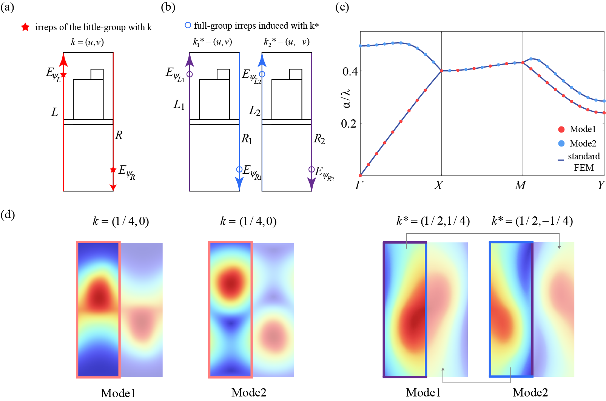

# symmetry-FEM-for-optical-nonsymmorphic-problem
nonsymmorphic symmetry FEM for light band structure problem

## Overview
The Open-source MATLAB package nonsymmorphic symmetry adapted FEM (NSA-FEM) is an optical finite element program used for band structure problems. Based on the symmetry in group theory, it can divide the original problem into several sub-tasks and truncate the computational domain. This program significantly enhances the computational efficiency for band structure analysis problems. We provided examples of photonic crystal gratings with plane group pg, twisted quadrupole topological photonic crystals with plane group pg and photonic nodal line space group, respectively.
## Usage
### MeshData
1.By changing the .mph file name in the MakeMeshData.mat program, users can generate the corresponding COMSOL mesh data.
2.Here's a description of the 2D mesh data structure:
Mesh.Nodes: An n×2 double array representing the coordinates of the nodes.
Mesh.NbrNodes: An integer representing the number of nodes.
Mesh.Elements: An n×3 integer array indicating the indices of the elements.
Mesh.NbrElement: An integer representing the number of elements.
Mesh.Domains: An n×1 integer array representing the regions.
Mesh.Edge: An n×2 integer array representing the edges.
Mesh.EdgeOfElements: An n×1 double array indicating the index of edges with respect to elements.
Mesh.NbrEdge: An integer representing the number of edges.
Mesh.Edges: An n×2 integer array representing the boundary edges.
Mesh.Edgesflag: An n×1 integer array indicating the indices of the boundary edges.
Mesh.coonOfEdges: An n×2 double array representing the boundary edges corresponding to elements.
Mesh.domainOfEdges: An n×1 integer array indicating the region to which each boundary edge belongs.
3.Here's a description of the 3D mesh data structure:
Mesh.NbrNodes: An integer representing the number of vertices.
Mesh.NbrElements: An integer representing the number of tetrahedra.
Mesh.Nodes: A 3×n array representing the coordinates of the vertices.
Mesh.Domains: An n×1 integer array that contains the indices of the regions for the tetrahedra.
Mesh.Elements: A 4×n integer array indicating the indices of the vertices that form each tetrahedron.
Mesh.Tris: A 3xn integer array representing the boundary faces.
Mesh.Trisflag: An n×1 integer array indicating the region to which each boundary face belongs.

### function for matrix assembly
1. `Assembel.m`:Used for standard FEM matrix assembly with Irreps of the little group at k. Output Ai,Aj,Av,Bi,Bj,Bv for the assembly of sparse matrices A and B.
2. `Assembel2.m`:Used for matrix assembly with full-group Irreps induced at k∗. Output A2i,A2j,A2v,B2i,B2j,B2v for the assembly of sparse matrices A2 and B2.
### Main function of FEM
1. `Bandgap.m`: Main function of the NSA-FEM to compute the band structure of the model in nonsymmorphic symmetry configuration.
### Run examples
Run the `Assembel.m`(`Assembel2.m`) to calculate sparse matrices A and B. Run the `Bandgap.m`to calculate the band structure.
